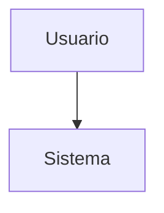

# Diagramas C4 — {{Nome do Projeto}}

Guia de referencia para a estrutura de diagramas arquiteturais do projeto, baseada no **Modelo C4** de Simon Brown.

---

## 1. O que e o Modelo C4

O Modelo C4 organiza a documentacao visual de um sistema de software em **4 niveis de zoom**, do mais abstrato ao mais detalhado:

| Nivel | Nome | Proposito |
|-------|------|-----------|
| 1 | **Context** (Contexto) | Visao de alto nivel: quem usa o sistema e com quais sistemas externos ele se comunica. |
| 2 | **Containers** (Conteineres) | Zoom no sistema: quais aplicacoes, bancos de dados, filas e servicos compoe a solucao. |
| 3 | **Components** (Componentes) | Zoom em um conteiner: quais modulos, servicos ou camadas existem dentro de cada conteiner. |
| 4 | **Code** (Codigo) | Zoom em um componente: classes, interfaces e relacionamentos internos. |

> **Nota:** O Nivel 4 (Code) e intencionalmente omitido nesta estrutura de diagramas. Na pratica, esse nivel de detalhe e melhor representado pelo proprio codigo-fonte, que serve como a documentacao mais precisa e atualizada dessa camada.

---

## 2. Estrutura de Diretorios

```
docs/diagrams/
├── README.md                          # Este guia
├── context/
│   └── system-context.mmd             # Nivel 1 — Diagrama de contexto do sistema
├── containers/
│   └── container-diagram.mmd          # Nivel 2 — Diagrama de conteineres
├── components/
│   └── {{nome-do-conteiner}}.mmd      # Nivel 3 — Um diagrama por conteiner principal
├── sequences/
│   └── {{nome-do-fluxo}}.mmd          # Diagramas de sequencia dos fluxos criticos
├── deployment/
│   └── production.mmd                 # Diagrama de deploy/infraestrutura em producao
└── domain/
    ├── class-diagram.mmd              # Diagrama de classes do dominio
    ├── er-diagram.mmd                 # Diagrama entidade-relacionamento (banco de dados)
    └── state-{{entidade}}.mmd         # Diagramas de maquina de estados por entidade
```

---

## 3. Como Navegar

A leitura recomendada segue a logica de **zoom progressivo**:

1. **Comece por `context/`** — Entenda o panorama geral: quem sao os usuarios, quais sistemas externos participam e qual e o escopo do {{Nome do Projeto}}.
2. **Avance para `containers/`** — Veja como o sistema e dividido internamente: quais aplicacoes, servicos e bancos de dados existem e como se comunicam.
3. **Aprofunde em `components/`** — Escolha um conteiner especifico e veja seus modulos internos, responsabilidades e dependencias.
4. **Consulte as demais pastas conforme a necessidade:**
   - `sequences/` para entender o fluxo temporal de operacoes criticas.
   - `deployment/` para entender a infraestrutura e o ambiente de producao.
   - `domain/` para entender o modelo de dominio, a estrutura de dados e as maquinas de estado.

---

## 4. Convencoes

- **Arquivos `.mmd`** contem Mermaid puro, sem markdown wrapper (sem blocos ` ```mermaid `). Isso permite que ferramentas de renderizacao os processem diretamente.
- **Comentarios** sao escritos com `%%` e servem como orientacoes para quem edita os diagramas:
  ```
  %% Substituir {{Nome do Sistema}} pelo nome real do projeto
  ```
- **Placeholders `{{...}}`** indicam campos editaveis que devem ser preenchidos com informacoes reais do projeto. Exemplos:
  - `{{Nome do Projeto}}`
  - `{{Nome do Sistema Externo}}`
  - `{{nome-do-conteiner}}`
  - `{{Tecnologia}}`

### Nomenclatura para Múltiplos Diagramas

Quando houver mais de um diagrama por pasta, siga estas convenções:

| Pasta | Padrão de Nome | Exemplos |
|-------|---------------|----------|
| `components/` | `{{container}}-components.mmd` | `api-components.mmd`, `worker-components.mmd` |
| `sequences/` | `{{nome-do-fluxo}}.mmd` | `auth-flow.mmd`, `checkout-flow.mmd`, `payment-flow.mmd` |
| `deployment/` | `{{ambiente}}.mmd` | `production.mmd`, `production-scaled.mmd`, `staging.mmd` |
| `domain/` | `state-{{entidade}}.mmd` | `state-order.mmd`, `state-payment.mmd`, `state-subscription.mmd` |

> Use nomes descritivos em kebab-case. O nome do arquivo deve deixar claro o conteúdo sem precisar abri-lo.

---

## 5. Como Editar e Visualizar

### VSCode

Instale a extensao **Mermaid Preview** (ou similar, como "Markdown Preview Mermaid Support"). Com o arquivo `.mmd` aberto, use o comando da extensao para visualizar o diagrama renderizado em tempo real.

### CLI com mermaid-cli

Instale o pacote globalmente:

```bash
npm install -g @mermaid-js/mermaid-cli
```

Gere uma imagem a partir de qualquer diagrama:

```bash
mmdc -i docs/diagrams/context/system-context.mmd -o docs/diagrams/context/system-context.svg
```

Formatos suportados: `.svg`, `.png`, `.pdf`.

### GitHub

O GitHub **nao renderiza arquivos `.mmd` diretamente** na visualizacao de arquivos. Porem, voce pode colar o conteudo de um diagrama em issues, pull requests ou arquivos Markdown usando o wrapper:

````

````

---

## 6. Mapa de Referencias

Tabela de correspondencia entre cada diagrama e a secao do blueprint onde seu conteudo e descrito textualmente:

| Diagrama | Secao do Blueprint |
|----------|-------------------|
| `context/system-context.mmd` | `00-context.md` |
| `containers/container-diagram.mmd` | `06-system-architecture.md` |
| `components/*.mmd` | `06-system-architecture.md` |
| `sequences/*.mmd` | `07-critical_flows.md` |
| `deployment/production.mmd` | `06-system-architecture.md`, `14-scalability.md` |
| `domain/class-diagram.mmd` | `04-domain-model.md` |
| `domain/er-diagram.mmd` | `05-data-model.md` |
| `domain/state-*.mmd` | `09-state-models.md` |

> Use esta tabela para manter diagramas e documentacao textual sincronizados. Ao atualizar um diagrama, revise a secao correspondente do blueprint — e vice-versa.
